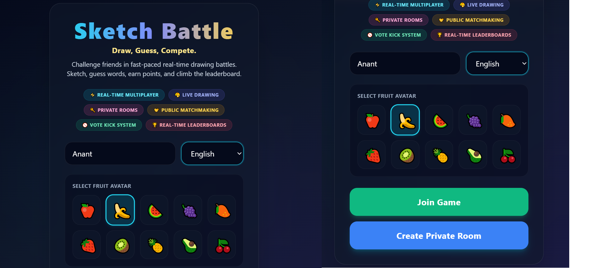
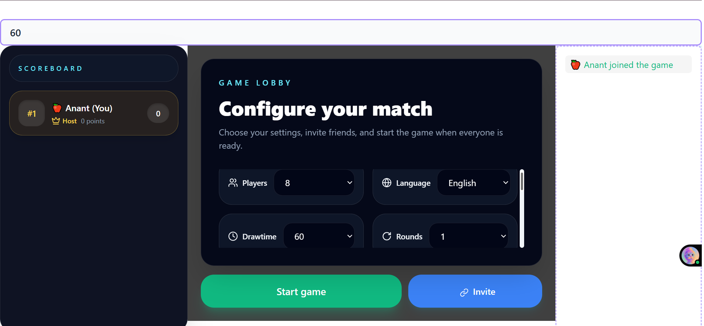
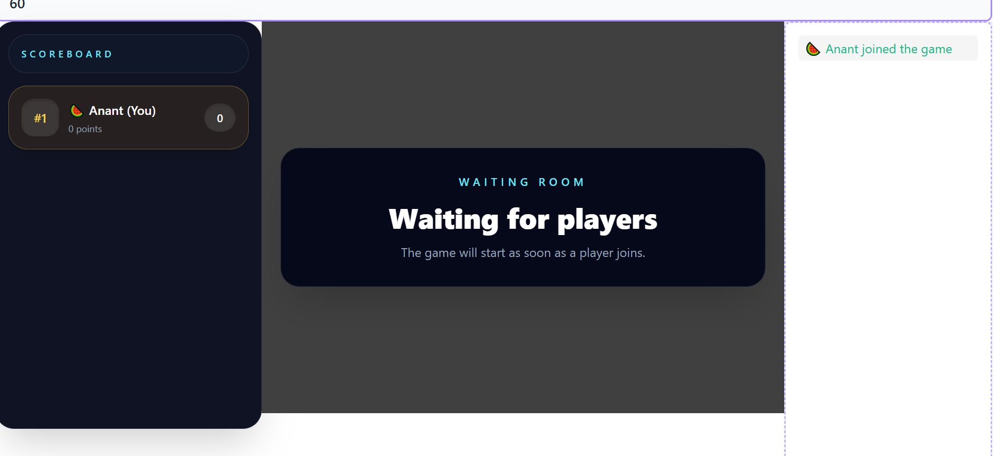
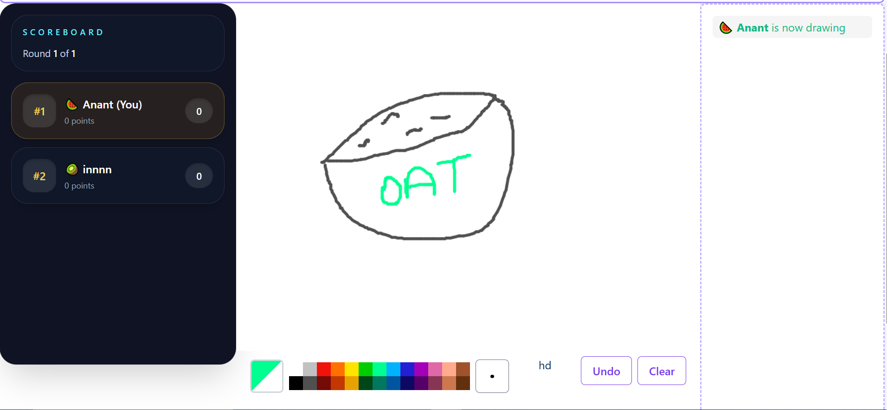
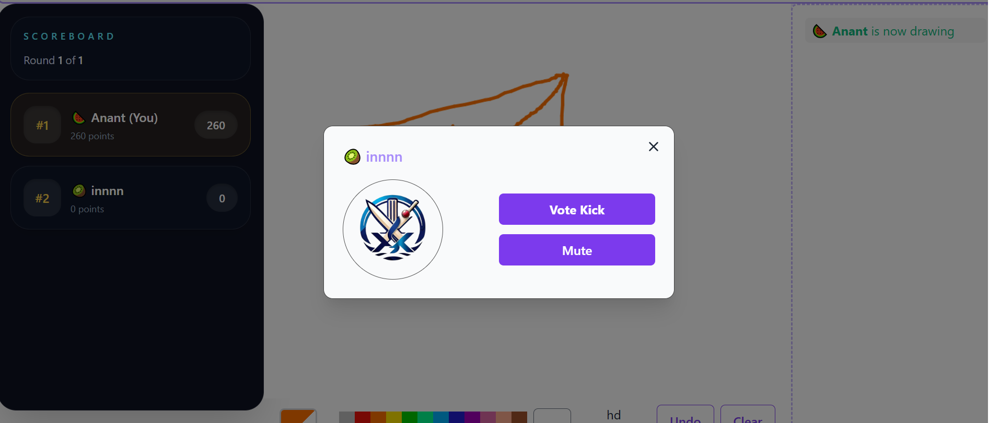
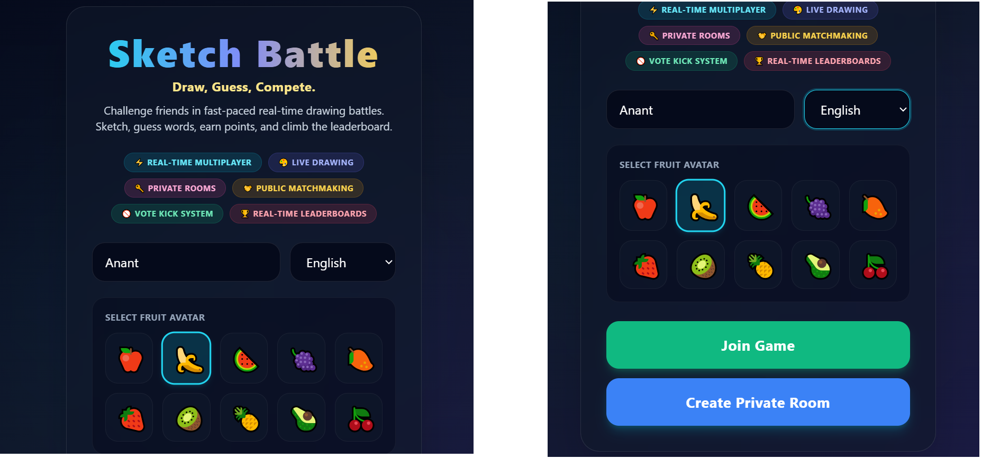

# 🎨 SketchBattle

## Real-Time Multiplayer Drawing & Guessing Game

SketchBattle is a real-time multiplayer drawing and guessing game where players compete by sketching words, guessing drawings, earning points, and climbing the room leaderboard.

Built using React, TypeScript, Node.js, Express, and Socket.IO, the application supports private rooms, public matchmaking, live drawing synchronization, moderation controls, and interactive multiplayer gameplay.

---
## Tech Stack


## 🚀 Live Demo

**Frontend (Vercel):**
[https://skribbl-multiplayer-game.vercel.app/]

**Backend (Render):**
[https://skribbl-multiplayer-game.onrender.com]

---

## ✨ Features

### 🎮 Core Gameplay

* Real-time drawing canvas
* Live word guessing
* Round-based gameplay
* Automatic score calculation
* Winner leaderboard screen
* Multiple language support
* Automatic word assignment fallback

### 🌐 Multiplayer Features

* Private room creation
* Invite link sharing
* Public matchmaking
* Automatic room assignment
* Real-time room synchronization
* Live player activity feed
* Auto-start public lobby system

### 🍎 Avatar System

* Fruit avatar selection
* Avatar synchronization across all players
* Avatar display in:

  * Lobby
  * Scoreboard
  * Chat feed
  * Winner screen
  * Player actions dialog

### 🛡️ Moderation Features

#### Host Controls

* Direct player kick
* Host badge identification
* Host protection

#### Vote Kick System

* Majority-based vote kicking
* Self-vote prevention
* Host vote-kick protection
* Secure server-side validation

### ⚡ Real-Time Synchronization

* Live drawing updates
* Instant chat updates
* Real-time score updates
* Turn synchronization
* Room state synchronization
* Player join/leave synchronization

---

## 🏗️ Tech Stack

### Frontend

* React
* TypeScript
* Vite
* Socket.IO Client

### Backend

* Node.js
* Express.js
* TypeScript
* Socket.IO

### Deployment

* Vercel
* Render

---

## 📂 Project Structure

```text
SketchBattle/
│
├── client/
│   ├── src/
│   ├── public/
│   └── package.json
│
├── server/
│   ├── src/
│   │   ├── game/
│   │   ├── socket/
│   │   ├── utils/
│   │   └── types/
│   │
│   ├── words/
│   └── package.json
│
└── README.md
```

---

## ⚙️ Installation

### Clone Repository

```bash
git clone <repository-url>
cd SketchBattle
```

### Backend Setup

```bash
cd server
npm install
npm run dev
```

Backend runs on:

```text
http://localhost:3000
```

### Frontend Setup

```bash
cd client
npm install
npm run dev
```

Frontend runs on:

```text
http://localhost:5173
```

---

## 🔌 Environment Variables

### Client (.env)

```env
VITE_SOCKET_URL=http://localhost:3000
```

### Server (.env)

```env
PORT=3000
```

---

## 🎲 How To Play

1. Enter your name.
2. Select a fruit avatar.
3. Create a private room or join public matchmaking.
4. Wait for players to join.
5. Start the game.
6. Draw the assigned word.
7. Other players guess through chat.
8. Earn points for correct guesses and successful drawings.
9. Win by finishing with the highest score.

---

## 🧠 Major Custom Enhancements

Compared to the original base implementation, the following enhancements were added:

* Complete SketchBattle rebranding
* Redesigned landing page
* Public matchmaking improvements
* Room capacity validation
* Host kick functionality
* Vote kick system improvements
* Host protection
* Self-vote prevention
* Fruit avatar system
* Avatar synchronization
* Multiplayer moderation controls
* Production deployment fixes
* Improved room synchronization
* Public lobby auto-start logic

---

## 📸 Screenshots

## Home Page


## Private Room


## Public Matchmaking


## Gameplay


## Moderation Features


## Winner Screen


---

## 👨‍💻 Author

**Anant Vats**

B.Tech Computer Science Engineering

Ajay Kumar Garg Engineering College (AKGEC)

---

## 📄 License

This project is intended for educational and learning purposes.
